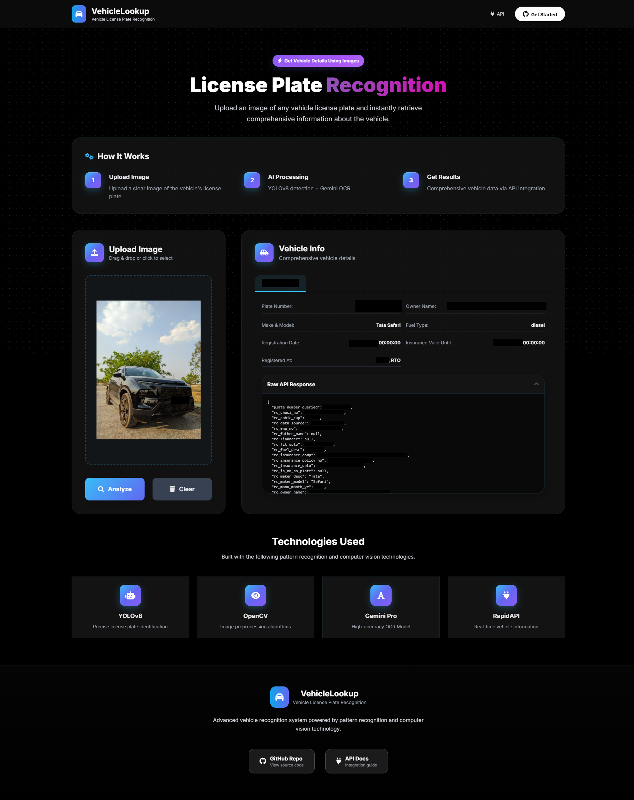

# VehicleLookup: AI-Powered License Plate Recognition



VehicleLookup is a full-stack web application that uses computer vision and AI to recognize license plates from vehicle images. It detects the plate, extracts the registration number using Optical Character Recognition (OCR), and fetches official vehicle details from an external API, presenting the information in a clean, modern web interface.

---

## Features

*   **Interactive Web UI**: A sleek, responsive frontend built with Tailwind CSS for uploading images and viewing results.
*   **Multi-Plate Detection**: Capable of detecting and processing multiple license plates within a single image.
*   **Detailed Vehicle Information**: Retrieves comprehensive data including owner name, make/model, fuel type, registration date, and insurance validity.
*   **Real-time Processing Log**: An optional, collapsible terminal view on the frontend shows the real-time status of the backend pipeline for debugging and transparency.
*   **Error Handling**: Gracefully handles API errors, unreadable plates, and processing failures, providing clear feedback to the user.

---

## How It Works: The Processing Pipeline

The application follows a four-stage pipeline orchestrated by `pipeline.py`:

1.  **Plate Detection (`preprocess_plate.py`)**: The uploaded image is processed by a custom-trained **YOLOv8** model to detect and locate license plates. Each detected plate is cropped and saved as a separate image.
2.  **OCR (`ocr.py`)**: Each cropped plate image is sent to the **Google Gemini Pro Vision** model. The model performs OCR to extract the alphanumeric registration number and returns it in a structured JSON format.
3.  **Data Retrieval (`api_call.py`)**: The extracted registration number is used to query a **RapidAPI** endpoint, which returns detailed vehicle information from RTO (Regional Transport Office) records.
4.  **Display Results (`main.py` & `script.js`)**: The Flask backend serves the final data to the frontend, where it is dynamically rendered in an organized, tabbed view for each successfully identified plate.

---

## Tech Stack

| Category          | Technology / Service                                                                                             |
| ----------------- | ---------------------------------------------------------------------------------------------------------------- |
| **Backend**       | Python, Flask                                                                                                    |
| **Frontend**      | HTML, Tailwind CSS, JavaScript                                                                                   |
| **Detection**     | **YOLOv8** (`ultralytics`) custom-trained on an Indian license plate dataset.                                      |
| **Image Processing**| **OpenCV** for image manipulation and cropping.                                                                  |
| **OCR**           | **Google Gemini Pro Vision API** for high-accuracy text extraction.                                                |
| **Vehicle Data**  | **RapidAPI** ([RTO Vehicle Details](https://rapidapi.com/fire-api-fire-api-default/api/rto-vehicle-details-rc-puc-insurance-mparivahan)) |
| **Environment**   | `python-dotenv` for managing API keys.                                                                           |

---

## Project Structure

```
.
├── assets/                  # Screenshots for README
├── input_images/            # Stores images uploaded by the user
├── cropped_images/          # Stores cropped license plates from YOLO detection
├── ocr_results/             # Stores JSON output from the Gemini OCR step
├── api_results/             # Stores final JSON response from the RapidAPI call
├── templates/               # Frontend files (HTML, CSS, JS)
│   ├── index.html
│   ├── script.js
│   └── styles.css
├── .env                     # Environment variables (API keys) - Not committed
├── .gitignore               # Specifies files for Git to ignore
├── api_call.py              # Fetches vehicle data using the RapidAPI
├── best.pt                  # Custom-trained YOLOv8 model weights
├── env_setup.py             # Initializes environment variables and YOLO model
├── main.py                  # Main Flask application entry point and API routes
├── ocr.py                   # Performs OCR on cropped plates using Gemini
├── pipeline.py              # Orchestrates the entire processing sequence
├── preprocess_plate.py      # Detects and crops license plates using YOLOv8
└── requirements.txt         # Python dependencies
```

---

## Setup and Installation

### 1. Clone the Repository

```bash
git clone https://github.com/Abhay117004/PR.git
cd PR
```

### 2. Create and Activate a Virtual Environment

**Windows**
```cmd
python -m venv venv
venv\Scripts\activate
```

**macOS / Linux**
```bash
python3 -m venv venv
source venv/bin/activate
```

### 3. Install Dependencies

Install all required Python packages from the `requirements.txt` file.

```bash
pip install -r requirements.txt
```

### 4. Configure Environment Variables

Create a file named `.env` in the root directory of the project and add your API keys:

```env
# Get your key from Google AI Studio: https://aistudio.google.com/
GEMINI_API_KEY="your_gemini_api_key_here"

# Get your key from RapidAPI: https://rapidapi.com/
RAPIDAPI_KEY="your_rapidapi_key_here"
```

---

## Usage

1.  Run the Flask web server:

    ```bash
    python main.py
    ```

2.  The application will automatically open in your default web browser at:

    ```
    http://127.0.0.1:5000
    ```

3.  Drag and drop or click to upload a vehicle image.
4.  Click the **Analyze** button to start the pipeline.
5.  View the retrieved vehicle details in the results panel.

---

## Notes and Limitations

*   **Hardware**: The application is configured to use a CPU.
*   **API Limits**: The free tiers of the Gemini and RapidAPI services have usage limits. Be mindful of the number of requests.
*   **Accuracy**: The accuracy of the results depends heavily on the quality of the input image. Clear, well-lit, and unobstructed license plates yield the best results.